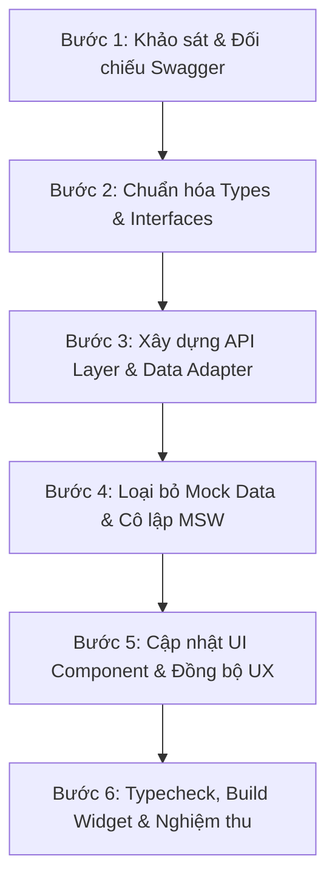

# TÀI LIỆU HƯỚNG DẪN CHUẨN (SOP): GẮN API THỰC TẾ & ĐỒNG BỘ UI/UX
> **Áp dụng:** Dự án `payroll-admin-portal`  
> **Module tham chiếu mẫu:** Tab Người phụ thuộc (Dependents)  
> **Mục đích:** Hướng dẫn chuẩn từng bước để thay thế Mock Data bằng API Swagger thực tế, loại bỏ API ảo, đồng bộ chuẩn UI/UX và ngăn ngừa lỗi runtime cho các subtab tiếp theo (Phép năm, Công đoàn, BHXH, Thu nhập khác, Giảm trừ khác, v.v.).

---

## I. NGUYÊN TẮC CỐT LÕI (CORE PRINCIPLES)

1. **Chỉ sử dụng API có trên Swagger thực tế:**
   - Tuyệt đối không tự chế endpoint ảo hoặc giả lập API mà backend chưa có.
   - Nếu swagger không có endpoint đó, phải loại bỏ tính năng phụ thuộc hoặc thay thế bằng luồng hợp lệ đã thống nhất.
2. **Loại bỏ triệt để Mock Data trong code chạy thật:**
   - Không import dữ liệu từ `lib/mock-data.ts` vào các component nghiệp vụ.
   - Tách biệt hoàn toàn luồng Production/Widget khỏi Mock Service Worker (MSW).
3. **Data Adapter / Normalizer linh hoạt:**
   - Backend C# (.NET) thường trả về cả dạng `PascalCase` (`DependentName`, `IdNumber`) hoặc `camelCase` (`dependentName`, `idNumber`), hoặc tên trường khác frontend (`dependentIdNumber` vs `identityNumber`).
   - Tầng `lib/api.ts` phải đóng vai trò Adapter: chuẩn hóa dữ liệu đầu vào/ra, cung cấp giá trị mặc định (`fallback`) an toàn, chống `null`/`undefined`.
4. **Đồng bộ UI/UX theo Design System chuẩn:**
   - Thống nhất các thành phần: `SaveBar` (thanh lưu nổi), `TablePaginationFooter`, `Badge`, `Modal`, `SearchableSelect`.
   - Định dạng ngày tháng hiển thị người dùng: `dd/mm/yyyy` (dùng helper `formatDate`).
   - Định dạng ngày gửi lên backend và form input date: `YYYY-MM-DD`.
5. **Không đặt combo-box chọn Dự án / Kỳ lương bên trong Toolbar của Subtab:**
   - Header chung của trang (`EmployeesTab`) đã có sẵn `GsProjectCombobox` để quản lý bộ lọc dự án tập trung và tự động truyền prop `projectId` xuống từng subtab.
   - Toolbar bên trong subtab **chỉ chứa**: Phân loại Pills (bên trái) và Ô tìm kiếm (bên phải). Tuyệt đối không tạo lại dropdown chọn dự án gây trùng lặp và không đồng bộ.
6. **Zero TypeScript Errors & Clean Widget Bundles:**
   - Bắt buộc vượt qua `npx tsc --noEmit` trước khi build.
   - Build và tự động deploy sang main project: `npm run build:widgets`.

---

## II. QUY TRÌNH 6 BƯỚC TRIỂN KHAI (STEP-BY-STEP SOP)



---

### BƯỚC 1: KHẢO SÁT & ĐỐI CHIẾU SWAGGER (API AUDIT)
1. Mở tài liệu Swagger / OpenAPI của backend:
   - Liệt kê toàn bộ endpoint của module (URL, Method: `GET`, `POST`, `PUT`, `DELETE`).
   - Kiểm tra Query Parameters (phân trang: `pageIndex`/`page`, `pageSize`, bộ lọc: `projectId`, `status`, `keyword`, `fromDate`, `toDate`).
   - Kiểm tra Request Body (JSON payload, form-data).
   - Kiểm tra Response Body (cấu trúc trả về: `{ items: [], total: 0 }` hay `{ data: { items: [] } }` hay mảng trực tiếp `[]`).
2. Rà soát lại code hiện tại:
   - Đánh dấu các endpoint **thừa / không có trên Swagger** để xóa bỏ.
   - Đánh dấu các trường bị lệch tên giữa Frontend và Swagger.

---

### BƯỚC 2: CHUẨN HÓA TYPES & INTERFACES (`lib/types.ts`)
1. Khai báo các type/interface đại diện cho:
   - **Entity Data Model**: Dữ liệu chi tiết của một bản ghi.
   - **List Response Model**: Cấu trúc danh sách phân trang (`items`, `total`, `page`, `pageSize`, `totalRow`).
   - **Create / Update Request Payload**: Dữ liệu gửi lên khi tạo mới hoặc cập nhật.
   - **Filter & Enum**: Các mã trạng thái hợp lệ, mã danh mục (DocumentType, Relationship, v.v.).
2. Quy định chuẩn kiểu dữ liệu:
   - Các trường ngày tháng nên ghi chú rõ định dạng: `string; // YYYY-MM-DD`.
   - Các trường có thể rỗng: `string | null | undefined`.

---

### BƯỚC 3: XÂY DỰNG API LAYER & DATA ADAPTER (`lib/api.ts`)
1. Sử dụng helper `request<T>(url, options)` dùng chung của dự án để đảm bảo cookie, token và base URL được quản lý thống nhất.
2. **Adapter Normalization Pattern** (Cực kỳ quan trọng để chống crash):
   ```typescript
   getExampleListV3: (params?: { projectId?: string | number; search?: string; page?: number; pageSize?: number }) => {
     const query = new URLSearchParams({
       projectId: String(params?.projectId || ""),
       keyword: params?.search || "",
       pageIndex: String(params?.page || 1),
       pageSize: String(params?.pageSize || 20),
     });

     return request<any>(`/api/web/payroll/my-endpoint?${query}`).then((res) => {
       const rawData = res.data || res || {};
       const rawList = Array.isArray(rawData)
         ? rawData
         : (rawData.items || rawData.Items || rawData.data || rawData.rows || []);

       const items = rawList.map((item: any) => ({
         id: Number(item.id ?? item.Id ?? item.entityId ?? 0),
         code: item.code || item.Code || "",
         fullName: item.fullName || item.FullName || item.name || "",
         // Mapping an toàn hỗ trợ cả camelCase và PascalCase
         identityNumber: item.idNumber || item.IdNumber || item.identityNumber || item.IdentityNumber || "",
         effectiveFrom: item.effectiveFrom || item.EffectiveFrom || "",
         effectiveTo: item.effectiveTo || item.EffectiveTo || "",
         // Đảm bảo cờ hành động luôn khả dụng
         canEdit: true,
         canApprove: String(item.status).toUpperCase() === "PENDING",
         // Tránh crash khi render nested object
         actor: {
           fullName: item.actor?.fullName || item.createdByName || item.createdBy || "Hệ thống",
           roleName: item.actor?.roleName || item.roleName || "Quản trị viên",
         },
       }));

       return {
         items,
         total: Number(rawData.total ?? rawData.Total ?? rawData.totalRow ?? items.length),
         page: Number(rawData.page ?? rawData.Page ?? 1),
         pageSize: Number(rawData.pageSize ?? rawData.PageSize ?? 20),
       };
     });
   },
   ```
3. Xóa hoàn toàn các hàm API gọi đến endpoint không tồn tại trên Swagger.

---

### BƯỚC 4: LOẠI BỎ MOCK DATA & CÔ LẬP MSW
1. Kiểm tra trong component tab: Đảm bảo **không** có lệnh `import { ... } from "@/lib/mock-data"`.
2. Toàn bộ dữ liệu hiển thị phải đến từ `useQuery` gọi API qua `api.xxx()`.
3. Kiểm tra `mocks/handlers.ts`: Không thêm mock handler can thiệp vào các API thật đang chạy trên môi trường tích hợp.

---

### BƯỚC 5: CẬP NHẬT UI COMPONENT & ĐỒNG BỘ UX (`components/...-subtab.tsx`)

#### 1. Bảng dữ liệu (Data Table)
- Sử dụng `formatDate(row.date)` cho toàn bộ cột ngày tháng (hiển thị `dd/mm/yyyy`).
- Cột trạng thái dùng `Badge` chuẩn với màu sắc rõ ràng (PENDING: vàng/cam, APPROVED: xanh lá, REJECTED: đỏ, DRAFT: xám).
- Cột thao tác (Actions):
  - Luôn mở nút **Chỉnh sửa** (Pencil) và **Xem chi tiết** (Eye).
  - Nút **Phê duyệt** (Check) / **Từ chối** (X) hiển thị khi bản ghi ở trạng thái PENDING hoặc `canApprove`/`canReject = true`.

#### 2. Đồng bộ thanh lưu nổi (SaveBar)
- Thay thế các thanh action bar tự viết bằng component `SaveBar` chuẩn của hệ thống:
  ```tsx
  <SaveBar
    visible={selectedIds.size > 0}
    saving={bulkApproving}
    onSave={handleBulkApprove}
    onCancel={() => setSelectedIds(new Set())}
    title={
      <span>
        Đã chọn <strong className="text-primary font-bold">{selectedIds.size}</strong> bản ghi
      </span>
    }
    description="Thực hiện thao tác hàng loạt cho các mục đã chọn"
    saveLabel="Phê duyệt hàng loạt"
    cancelLabel="Hủy chọn"
  />
  ```

#### 3. Form Modal (Thêm mới & Chỉnh sửa)
- Các trường ngày tháng dùng `<input type="date" />`.
- Khi bind dữ liệu vào form edit, luôn cắt chuỗi ISO 10 ký tự: `dep.effectiveFrom ? dep.effectiveFrom.slice(0, 10) : ""`.
- Đổi nhãn rõ ràng: `Hiệu lực từ ngày`, `Hiệu lực đến ngày (Để trống nếu vô thời hạn)`.
- Nút submit ở Footer dùng Icon `<Save />` và text chuẩn: `"Lưu thay đổi"` / `"Lưu hồ sơ"`.

#### 4. Defensive Rendering trong Modal/Drawer (Chống Crash)
- Tuyệt đối không gọi trực tiếp thuộc tính con sâu mà không có optional chaining hoặc fallback:
  - ❌ `log.actor.fullName`
  - ✅ `log.actor?.fullName || "Hệ thống"`
  - ❌ `log.dependent.fullName`
  - ✅ `log.dependent?.fullName`

#### 5. Chuẩn hóa Toolbar bảng dữ liệu (Data Table Toolbar)
- **Không đặt combo-box chọn Dự án bên trong Subtab:** Header chính của trang (`EmployeesTab`) đã có sẵn `GsProjectCombobox` để quản lý bộ lọc dự án tập trung và tự động truyền prop `projectId` xuống từng subtab.
- **Không lặp lại bộ lọc pill khi đã có KPI Summary Cards:** Nếu subtab đã có các thẻ KPI thống kê ở trên hoạt động như bộ lọc tương tác (như tab Phép năm), không hiển thị thêm hàng nút pill bên dưới thanh toolbar để tránh trùng lặp thông tin.
- **Bố cục chuẩn của Toolbar**:
  - **Bên trái**: Tiêu đề/số lượng bản ghi (`Danh sách nhân sự ({total})`) hoặc các nút/Pill phân loại trạng thái (`filter-status-pills`) nếu chưa có thẻ thống kê.
  - **Bên phải**: Duy nhất ô tìm kiếm (`Search Box`), căn lề `ml-auto`.

#### 6. Chuẩn hóa Modal Import Excel (2-Step Import Wizard)
- **Tuyệt đối không dùng modal kiểu cũ** (1 ô chọn tệp thô sơ, nút tải mẫu vứt dưới footer).
- **Quy chuẩn duy nhất (Chuẩn 2 bước theo tab Người phụ thuộc):**
  - Kích thước modal: `size="lg"`.
  - **Bước 1 (Tải biểu mẫu Excel chuẩn):** Box `bg-slate-50 dark:bg-slate-800/60 border border-slate-200` với tiêu đề + mô tả bên trái, nút `[ 📥 Tải file mẫu (.xlsx) ]` bên phải có loading state.
  - **Bước 2 (Chọn tệp dữ liệu đã điền):** Vùng kéo thả (Dropzone) viền nét đứt (`dashed`), hỗ trợ drag & drop, icon `UploadCloud`. Khi đã chọn tệp, chuyển sang thẻ hiển thị `FileSpreadsheet` màu xanh lá kèm tên tệp, dung lượng và nút bấm đổi tệp.
  - **Footer:** Căn phải với 2 nút chuẩn `[ Hủy ]` và `[ 📤 Bắt đầu Import ]` (disabled khi chưa chọn tệp, loading khi đang submit).

#### 7. Cơ chế Project Guard (Bắt buộc chọn Dự án cụ thể khi Thêm mới / Khai báo / Import)
- Khi `projectId === "all"` hoặc chưa chọn dự án: Toàn bộ thao tác Thêm mới, Khai báo hoặc Import Excel **phải bị chặn lại** và hiển thị Toast cảnh báo:
  - `notify("Vui lòng chọn một dự án cụ thể ở thanh công cụ phía trên trước khi [thao tác]!", "warning")`.
  - Không mở Modal để bảo đảm toàn vẹn dữ liệu dự án.

---

### BƯỚC 6: KIỂM TRA, BUILD & NGHIỆM THU
1. **Kiểm tra TypeScript:**
   ```powershell
   npx tsc --noEmit
   ```
   *Yêu cầu: 0 lỗi type.*
2. **Build và triển khai Widget:**
   ```powershell
   npm run build:widgets
   ```
   *Kiểm tra file bundle được xuất và copy sang `C:\Hris\main-timetracking\UI\Contents\js\`.*
3. **Nghiệm thu trên giao diện:**
   - [ ] Tải danh sách và phân trang hoạt động tốt.
   - [ ] Tìm kiếm & Lọc (theo dự án, trạng thái) load đúng dữ liệu từ server.
   - [ ] Không có combo-box dự án trùng lặp trong toolbar của subtab.
   - [ ] Thêm mới bản ghi thành công và tự động refetch bảng.
   - [ ] Chỉnh sửa bản ghi thành công (form nạp đúng dữ liệu cũ).
   - [ ] Xem chi tiết hiển thị đầy đủ thông tin.
   - [ ] Thao tác Phê duyệt / Từ chối (đơn lẻ và hàng loạt).
   - [ ] Mở Nhật ký hoạt động (Audit logs) không bị văng lỗi.
   - [ ] Upload / Tải file chứng từ (nếu có).
   - [ ] Import Excel & Tải file mẫu template (nếu có).

---

## III. CASE STUDY THỰC TẾ: TAB NGƯỜI PHỤ THUỘC & PHÉP NĂM

Dưới đây là tóm tắt các lỗi thực tế đã xử lý để rút kinh nghiệm cho các tab sau:

| Vấn đề gặp phải | Nguyên nhân | Giải pháp xử lý |
| :--- | :--- | :--- |
| **Cột CCCD/MST trống trơn** | API backend trả về trường `dependentIdNumber` và `dependentTaxCode` nhưng frontend đang đọc `identityNumber` và `taxCode`. | Viết Adapter trong `lib/api.ts` map đa dạng: `item.dependentIdNumber \|\| item.identityNumber \|\| item.idNumber`. |
| **Cột Thao tác không bấm sửa được** | Backend không trả cờ `canEdit: true` khiến nút Edit bị ẩn/disable. | Gán cứng `canEdit: true` ở tầng Normalizer `api.getDependentsV3` để luôn cho phép sửa. |
| **Hiệu lực bị lệch format tháng/ngày** | Ban đầu UI dùng `<input type="month" />` (`YYYY-MM`), trong khi backend Swagger yêu cầu ngày đầy đủ (`YYYY-MM-DD`). | Chuyển toàn bộ sang `<input type="date" />`, hiển thị dạng `Từ dd/mm/yyyy` đến `Đến dd/mm/yyyy`. |
| **Bấm "Nhật ký" bị crash giao diện** | API trả về các log có `actor: null` hoặc dùng `createdByName`, code UI gọi thẳng `log.actor.fullName` gây `TypeError`. | Bổ sung Adapter tự động map `actor` kèm fallback `"Hệ thống"` và dùng optional chaining `log.actor?.fullName`. |
| **UI thanh chọn hàng loạt không đồng bộ** | Tab NPT dùng thanh nổi màu đen tự viết, không đồng bộ với thanh `SaveBar` của trang Công thức lương. | Tái sử dụng `SaveBar` từ `components/ui.tsx`, truyền props tùy biến `title`, `description`, `saveLabel`. |
| **Trùng lặp dropdown Dự án trong Toolbar** | Toolbar của subtab đặt thêm dropdown chọn dự án trong khi Header trang chính đã có `GsProjectCombobox`. | Xóa combo-box dự án trong subtab toolbar, chỉ giữ lại thanh Search bên phải và nhận `projectId` qua props. |

---

## IV. DANH SÁCH CHECKLIST KHI LÀM TAB TIẾP THEO

Khi bắt đầu làm bất kỳ tab nào tiếp theo (ví dụ: *Phép năm*, *Công đoàn phí*, *Bảo hiểm xã hội*, *Các khoản phụ cấp/trợ cấp*, *Giảm trừ khác*...):

- [ ] 1. Mở Swagger, đối chiếu endpoint của tab đó với `lib/api.ts`.
- [ ] 2. Xóa các endpoint không có trên Swagger khỏi `lib/api.ts`.
- [ ] 3. Kiểm tra DTO trong `lib/types.ts` khớp chính xác với Swagger model.
- [ ] 4. Viết Normalizer chống null/undefined/case-sensitive trong `lib/api.ts`.
- [ ] 5. Loại bỏ import mock data trong `components/...-subtab.tsx`.
- [ ] 6. Không đặt dropdown/combo-box chọn dự án trong toolbar subtab (dùng `projectId` từ header).
- [ ] 7. Đồng bộ định dạng ngày (`formatDate`), tiền tệ (`formatCurrency`).
- [ ] 8. Đồng bộ thanh `SaveBar` và các modal footer buttons (`<Save />`, `"Lưu thay đổi"`).
- [ ] 9. Kiểm tra optional chaining cho mọi trường lồng nhau trong modal/drawer.
- [ ] 10. Chạy `npx tsc --noEmit` đạt 0 lỗi.
- [ ] 11. Chạy `npm run build:widgets` và kiểm tra trên trình duyệt.

---
*Tài liệu được lưu trữ tại [docs/API_INTEGRATION_SOP.md](file:///c:/Users/truongthanh/payroll-admin-portal/docs/API_INTEGRATION_SOP.md) để phục vụ phát triển các module tiếp theo.*
