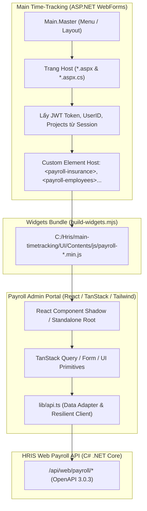
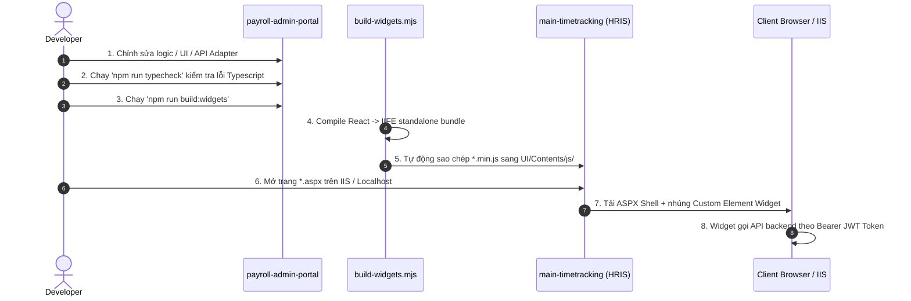

# HƯỚNG DẪN TÍCH HỢP HỆ THỐNG BẢNG LƯƠNG (PAYROLL) SANG MAIN-TIMETRACKING

> **Tài liệu kỹ thuật:** Tích hợp các phân hệ Bảng lương từ `payroll-admin-portal` (React / Vite Web Components) sang `main-timetracking` (ASP.NET WebForms).  
> **Cập nhật:** 2026-10-06  
> **Phiên bản:** 2.0.0  

---

## MỤC LỤC
1. [Tổng quan Kiến trúc Tích hợp (Architecture Overview)](#1-tổng-quan-kiến-trúc-tích-hợp)
2. [Nguyên tắc & Quy chuẩn Thực hiện (Integration Rules)](#2-nguyên-tắc--quy-chuẩn-thực-hiện)
3. [Chi tiết các Phân hệ & Cấu trúc Widget (Module Breakdown)](#3-chi-tiết-các-phân-hệ--cấu-trúc-widget)
4. [Cơ chế Giao tiếp Host (ASP.NET) và Web Component](#4-cơ-chế-giao-tiếp-host-aspnet-và-web-component)
5. [Quy trình Triển khai từng bước (Step-by-Step Workflow)](#5-quy-trình-triển-khai-từng-bước)
6. [Cấu hình Menu, Điều hướng & Phân quyền trên WebForms](#6-cấu-hình-menu-điều-hướng--phân-quyền)
7. [Xử lý Sự cố thường gặp (Troubleshooting & FAQs)](#7-xử-lý-sự-cố-thường-gặp)

---

## 1. TỔNG QUAN KIẾN TRÚC TÍCH HỢP

Hệ thống Bảng lương sử dụng mô hình **Micro-Frontend dạng Web Component (Custom Elements)** kết hợp với **Host Shell ASP.NET WebForms**:



### Các thành phần chính:
1. **Host Shell (`main-timetracking`):** Các trang ASPX đóng vai trò lấy thông tin phiên (User Token, Account ID, Dự án được phân quyền) và nhúng custom tag.
2. **Frontend Engine (`payroll-admin-portal`):** Được viết bằng React, TypeScript, Tailwind CSS, TanStack Query, đóng gói thành các file JS độc lập (`IIFE format`) qua Vite/Rolldown.
3. **Backend API Service:** Cung cấp các RESTful endpoints theo chuẩn OpenAPI 3.0.3 (`/api/web/payroll/*`), xác thực bằng `Bearer JWT`.

---

## 2. NGUYÊN TẮC & QUY CHUẨN THỰC HIỆN

### 🔴 Quy tắc 1: Tuân thủ Contract First (Bám sát OpenAPI 3.0.3)
- Chỉ gọi các endpoint và tham số có trong tài liệu OpenAPI (`openapi.yml`).
- Không tự chế endpoint giả lập hoặc gọi các URL không tồn tại trên backend.
- Request body gửi lên backend luôn sử dụng chuẩn **`camelCase`** (`employeeCode`, `projectId`, `baseSalary`, `year`, `month`, `note`).

### 🔴 Quy tắc 2: Data Normalization & Adapter An toàn
- Backend C# có thể trả về cả `PascalCase` (`FullName`, `BaseSalary`) hoặc `camelCase` (`fullName`, `baseSalary`).
- Tầng `lib/api.ts` phải đóng vai trò Adapter: bóc tách an toàn qua fallback (`item.fullName || item.FullName || item.employeeName || ""`), luôn chống crash khi dữ liệu trả về `null` hoặc `undefined`.

### 🔴 Quy tắc 3: Quản lý Dự án & Bộ lọc tập trung
- Mỗi trang đều hỗ trợ quản lý dự án linh hoạt:
  - Nếu trang chạy **độc lập (Standalone)**: Hiển thị `GsProjectCombobox` trên header trang để người dùng chọn dự án hoặc chọn "Tất cả dự án".
  - Nếu trang chạy **nhúng (Embedded)**: Nhận `projectId` từ thuộc tính `project-id="..."` do Host ASPX truyền vào.
- Tuyệt đối không đặt combo-box chọn dự án trùng lặp bên trong thanh công cụ con (Toolbar) của các Subtab.

### 🔴 Quy tắc 4: Cô lập Style & Không phá vỡ MasterPage
- Toàn bộ style của Widget được build tự động kèm CSS scoped/inline trong file bundle, không gây xung đột với CSS của DevExpress hoặc bootstrap của `Main.Master`.
- Thiết kế hỗ trợ responsive, dark/light mode và container co giãn linh hoạt (`min-height: 80vh`).

### 🔴 Quy tắc 5: Zero TypeScript Errors trước khi Build
- Bắt buộc chạy kiểm tra kiểu dữ liệu `npm run typecheck` trước khi build widget. Không được build khi còn lỗi compile.

---

## 3. CHI TIẾT CÁC PHÂN HỆ & CẤU TRÚC WIDGET

Hệ thống được module hóa thành **5 Widget độc lập** và **1 Widget tổng hợp (All-in-One)**:

| Phân hệ | Tên Widget | File Bundle (.min.js) | Trang Host ASPX | Chức năng chính |
| :--- | :--- | :--- | :--- | :--- |
| **1. Cấu hình Dự án** | `<payroll-projects>` | `payroll-projects.min.js` | `PayrollProjects.aspx` | Cấu hình ngày công chuẩn, công thức lương, chính sách tăng ca, danh mục phụ cấp cho từng dự án. |
| **2. Hồ sơ Lương Nhân viên** | `<payroll-employees>` | `payroll-employees.min.js` | `PayrollEmployees.aspx` | Quản lý phụ cấp/phúc lợi, giảm trừ khác, thu nhập khác, hợp đồng lương của nhân sự. |
| **3. Người phụ thuộc (Gia cảnh)** | `<payroll-dependents>` | `payroll-dependents.min.js` | `PayrollDependents.aspx` | Khai báo người phụ thuộc, upload tài liệu chứng từ (CCCD, khai sinh), duyệt/từ chối, import/export Excel. |
| **4. Bảo hiểm xã hội (D02-LT)** | `<payroll-insurance>` | `payroll-insurance.min.js` | `PayrollInsurance.aspx` | Sổ BHXH, báo tăng/giảm/điều chỉnh lương, dự toán mức đóng 32%, duyệt/từ chối biến động, import Excel. |
| **5. Bảng lương & Kỳ lương** | `<payroll-runs>` | `payroll-runs.min.js` | `PayrollRuns.aspx` | Khởi tạo kỳ lương theo tháng/dự án, tính lương tự động từ bảng công, chốt lương, xuất phiếu lương & Excel. |
| **6. Cổng Bảng lương Tổng hợp** | `<payroll-widget>` | `payroll-widget.min.js` | `PayrollPortal.aspx` | Tích hợp toàn bộ cả 5 phân hệ trong một giao diện duy nhất với menu chuyển tab nội bộ. |

---

## 4. CƠ CHẾ GIAO TIẾP HOST (ASP.NET) VÀ WEB COMPONENT

### 1. Phía Server ASP.NET WebForms (`*.aspx.cs`)
File Code-Behind lấy Token đăng nhập từ `Session` / `Users.Token` và danh sách dự án của người dùng:

```csharp
protected void Page_Load(object sender, EventArgs e)
{
    if (!IsPostBack)
    {
        try
        {
            ApiBaseUrl = LogicTier.Controllers.BaseController.pathSever ?? "";
            var token = Users != null ? Users.Token : string.Empty;
            ServerTokenJson = JsonConvert.SerializeObject(token ?? "");
            var userId = Users != null ? (Users.EmployeeId ?? Users.UserId) : 0;
            CurrentUserId = userId;

            if (!string.IsNullOrWhiteSpace(token))
            {
                var projects = ProjectListService.BuildProjectOptions(userId, token, "Tất cả dự án", includeAllProjects: false);
                if (projects != null && projects.Count > 0)
                {
                    var projectItems = projects.Select(p => new {
                        id = p.Value,
                        code = p.ProjectCodeDisplay,
                        name = p.ProjectNameDisplay
                    }).ToList();
                    InitialProjectsJson = JsonConvert.SerializeObject(projectItems);
                }
            }

            hdfPayrollToken.Value = token;
            string queryProject = Request.QueryString["projectId"] ?? Request.QueryString["project"] ?? string.Empty;
            hdfPayrollProjectId.Value = queryProject.Trim();
        }
        catch
        {
            InitialProjectsJson = "[]";
            hdfPayrollToken.Value = string.Empty;
            hdfPayrollProjectId.Value = string.Empty;
        }
    }
}
```

### 2. Phía Giao diện ASPX (`*.aspx`)
Nhúng thẻ Custom Element và nạp file script bundle tương ứng:

```html
<%@ Page Title="Quản trị bảo hiểm xã hội" Language="C#" MasterPageFile="~/Main.Master" AutoEventWireup="true"
    CodeBehind="PayrollInsurance.aspx.cs" Inherits="UI.Pages.PayrollInsurance" %>

<asp:Content ID="Content1" ContentPlaceHolderID="head" runat="server">
    <script>
        window.API_BASE_URL = "<%= ApiBaseUrl %>";
        window.__SERVER_PROJECTS = <%= InitialProjectsJson %>;
        window.__SERVER_TOKEN = <%= ServerTokenJson %>;
        window.__SERVER_USER_ID = <%= CurrentUserId %>;
    </script>
</asp:Content>

<asp:Content ID="Content2" ContentPlaceHolderID="main" runat="server">
    <asp:HiddenField ID="hdfPayrollToken" runat="server" ClientIDMode="Static" />
    <asp:HiddenField ID="hdfPayrollProjectId" runat="server" ClientIDMode="Static" />

    <div class="payroll-widget-container" style="min-height: 80vh; width: 100%;">
        <payroll-insurance
            id="payrollInsuranceWidget"
            api-base-url="<%= ApiBaseUrl %>"
            auth-token=""
            project-id=""
            theme="corporate">
        </payroll-insurance>
    </div>

    <!-- Script Module Bảo hiểm xã hội -->
    <script src="/Contents/js/payroll-insurance.min.js?v=<%= DateTime.UtcNow.Ticks %>"></script>

    <script type="text/javascript">
        (function () {
            function initWidget() {
                var widget = document.getElementById('payrollInsuranceWidget');
                var tokenNode = document.getElementById('hdfPayrollToken');
                var projectNode = document.getElementById('hdfPayrollProjectId');

                var token = tokenNode ? (tokenNode.value || '') : '';
                var projectId = projectNode ? (projectNode.value || '') : '';

                if (widget) {
                    if (token) widget.setAttribute('auth-token', token);
                    if (projectId) widget.setAttribute('project-id', projectId);
                }
            }
            if (document.readyState === 'loading') {
                document.addEventListener('DOMContentLoaded', initWidget);
            } else {
                initWidget();
            }
        })();
    </script>
</asp:Content>
```

---

## 5. QUY TRÌNH TRIỂN KHAI TỪNG BƯỚC (STEP-BY-STEP WORKFLOW)



### Chi tiết các bước thực hiện:

#### Bước 1: Phát triển & Kiểm thử trên môi trường React độc lập
- Mở thư mục `c:\Users\truongthanh\payroll-admin-portal`.
- Khởi động dev server:
  ```bash
  npm run dev
  ```
- Kiểm tra tính năng, bảng dữ liệu, modal, validate form trên giao diện Next.js.

#### Bước 2: Kiểm tra kiểu dữ liệu (Typecheck)
- Trước khi đóng gói, chạy lệnh:
  ```bash
  npm run typecheck
  ```
- Đảm bảo lệnh trả về kết quả `exit code 0` (không có bất kỳ lỗi TypeScript nào).

#### Bước 3: Đóng gói và Triển khai tự động sang WebForms
- Chạy lệnh build widget:
  ```bash
  npm run build:widgets
  ```
- Script `build-widgets.mjs` sẽ tự động biên dịch toàn bộ các entrypoint trong `src/widgets/` và copy các file `.min.js` sang:
  `C:\Hris\main-timetracking\UI\Contents\js\`

#### Bước 4: Kiểm tra & Đồng bộ trang Host ASPX trên Main Time-Tracking
- Mở thư mục `c:\Hris\main-timetracking\UI\Pages\`.
- Đảm bảo các trang `.aspx` và `.aspx.cs` đã tồn tại tương ứng:
  - `PayrollProjects.aspx`
  - `PayrollEmployees.aspx`
  - `PayrollDependents.aspx`
  - `PayrollInsurance.aspx`
  - `PayrollRuns.aspx`
  - `PayrollPortal.aspx`

#### Bước 5: Kiểm thử thực tế trên IIS / Time-Tracking
- Đăng nhập vào hệ thống Time-Tracking bằng tài khoản quản trị viên / kế toán.
- Truy cập vào từng menu Bảng lương để kiểm tra:
  - Token JWT đã được truyền tự động từ session vào widget chưa.
  - Dữ liệu có load đúng theo dự án đang chọn không.
  - Các thao tác Thêm / Sửa / Duyệt / Import Excel có hoạt động thông suốt không.

---

## 6. CẤU HÌNH MENU, ĐIỀU HƯỚNG & PHÂN QUYỀN

### 1. Cấu hình Sitemap (`Web.sitemap`)
Trong `c:\Hris\main-timetracking\UI\Web.sitemap`, khai báo các nút menu thuộc phân hệ Bảng lương:

```xml
<siteMapNode title="Quản trị bảng lương" roles="Admin,Accountant,Manager" description="Phân hệ tính lương">
    <siteMapNode url="~/Pages/PayrollProjects.aspx" title="Cấu hình dự án &amp; chính sách" description="Chính sách &amp; công thức lương" />
    <siteMapNode url="~/Pages/PayrollEmployees.aspx" title="Hồ sơ lương nhân viên" description="Phụ cấp &amp; chế độ đãi ngộ" />
    <siteMapNode url="~/Pages/PayrollDependents.aspx" title="Người phụ thuộc" description="Giảm trừ gia cảnh" />
    <siteMapNode url="~/Pages/PayrollInsurance.aspx" title="Bảo hiểm xã hội" description="Quản lý đóng BHXH &amp; D02-LT" />
    <siteMapNode url="~/Pages/PayrollRuns.aspx" title="Bảng tính lương" description="Tính lương &amp; chốt kỳ lương" />
    <siteMapNode url="~/Pages/PayrollPortal.aspx" title="Cổng bảng lương tổng hợp" description="Tất cả phân hệ trong một" />
</siteMapNode>
```

### 2. Phân quyền truy cập theo vai trò (Roles)
- **Kế toán lương (Accountant):** Toàn quyền xem, lập hồ sơ biến động, tính lương, duyệt đối soát, import excel.
- **Quản lý dự án (Manager / Project Leader):** Xem danh sách nhân viên, xem bảng lương dự án mình phụ trách, tạo yêu cầu biến động.
- **Nhân viên (Employee):** Chỉ xem phiếu lương cá nhân (nếu được cấp quyền).

---

## 7. XỬ LÝ SỰ CỐ THƯỜNG GẶP (TROUBLESHOOTING & FAQS)

### ❓ Sự cố 1: Trình duyệt vẫn hiển thị code JS cũ sau khi build
- **Nguyên nhân:** Trình duyệt cache file `.min.js`.
- **Giải pháp:** Trong trang `.aspx`, thêm timestamp cache-busting vào đường dẫn script:
  ```html
  <script src="/Contents/js/payroll-insurance.min.js?v=<%= DateTime.UtcNow.Ticks %>"></script>
  ```

### ❓ Sự cố 2: API trả về lỗi `401 Unauthorized`
- **Nguyên nhân:** Người dùng chưa đăng nhập hoặc `Users.Token` trong Session ASP.NET bị rỗng/hết hạn.
- **Giải pháp:** Kiểm tra hàm `Page_Load` của file `.aspx.cs`, đảm bảo `Users != null && !string.IsNullOrWhiteSpace(Users.Token)`. Nếu token rỗng, chuyển hướng người dùng về trang đăng nhập `Response.Redirect("~/Login.aspx")`.

### ❓ Sự cố 3: Lỗi `400 Bad Request` khi Import file Excel
- **Nguyên nhân:** Thiếu trường bắt buộc `projectId` trong form-data (OpenAPI quy định cả `file` và `projectId` đều là `required`).
- **Giải pháp:** Kiểm tra hàm gọi import trong `lib/api.ts`, đảm bảo truyền đủ cả 2 trường:
  ```typescript
  const formData = new FormData();
  formData.append("file", file);
  if (projectId) formData.append("projectId", String(projectId));
  ```

### ❓ Sự cố 4: Giao diện Widget bị che khuất hoặc bể layout trên ASP.NET
- **Nguyên nhân:** Container bao ngoài trong ASPX không có kích thước tối thiểu.
- **Giải pháp:** Đặt style chuẩn cho container bọc ngoài thẻ custom element:
  ```css
  .payroll-widget-container {
      padding: 8px 0 24px;
      min-height: 85vh;
      width: 100%;
      box-sizing: border-box;
  }
  ```

---

## 8. TỔNG KẾT
Tài liệu này là quy chuẩn kỹ thuật bắt buộc khi phát triển, mở rộng hoặc tích hợp thêm bất kỳ module tính lương mới nào từ `payroll-admin-portal` sang `main-timetracking`. Mọi thắc mắc và đóng góp vui lòng cập nhật trực tiếp vào tài liệu này để duy trì tính nhất quán cho toàn bộ dự án.
