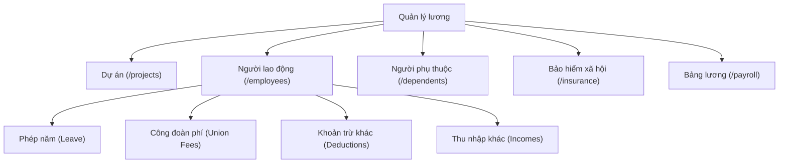

# TÀI LIỆU PHÂN TÍCH VÀ KẾ HOẠCH TRIỂN KHAI TÁI CẤU TRÚC MENU VÀ CƠ CHẾ CHỌN DỰ ÁN

> **Phiên bản:** 1.0.0  
> **Dự án:** `payroll-admin-portal` & Hệ thống HRIS Quản lý lương GRSC  
> **Trạng thái:** Bản phân tích kỹ thuật & Kế hoạch chi tiết (No Code)  
> **Ngày lập:** 01/10/2026  

---

## 1. TỔNG QUAN YÊU CẦU & BỐI CẢNH

### 1.1. Mục tiêu tái cấu trúc
Hệ thống Quản lý lương hiện tại đang gom các nghiệp vụ **Người phụ thuộc (NPT)** và **Bảo hiểm xã hội (BHXH)** vào làm các tab con (subtabs) bên trong trang "Người lao động". Đồng thời, cơ chế lọc dự án đang có một số điểm bất cập:
1. Khi vào trang Người lao động hoặc các phân hệ liên quan, hệ thống có logic ngầm tự động chọn dự án đầu tiên (`projects[0]`) thay vì mặc định xem toàn bộ hệ thống ("Tất cả dự án").
2. Khi người dùng muốn tạo mới bản ghi hoặc import Excel trong trạng thái xem tất cả dự án, hệ thống chưa có cơ chế bắt buộc (`required validation`) chọn dự án đích rõ ràng, dẫn đến nguy cơ nhập dữ liệu sai dự án.
3. Người phụ thuộc và Bảo hiểm xã hội là hai nghiệp vụ cốt lõi, độc lập, có quy mô dữ liệu lớn và quy trình nghiệp vụ chuyên biệt (khai báo, duyệt hồ sơ, đính kèm chứng từ, đối soát D02-LT, tra cứu sổ BHXH). Việc đặt 2 nghiệp vụ này làm tab con trong "Người lao động" làm tăng độ sâu điều hướng và hạn chế góc nhìn tổng thể toàn công ty.

### 1.2. Ba yêu cầu trọng tâm
1. **Trang Người lao động (và các phân hệ):** Mặc định chọn **"Tất cả dự án"** (`value="all"`), tuyệt đối không tự động chọn dự án đầu tiên (`projects[0]`). Khi người dùng thực hiện **Import Excel** hoặc **Tạo mới / Khai báo**, bắt buộc (`required`) phải chọn dự án cụ thể.
2. **Người phụ thuộc & Bảo hiểm xã hội:** Tách ra thành 2 menu độc lập, cùng cấp với "Người lao động" trong nhóm "Quản lý lương". Không bị bó hẹp trong context của một dự án cố định, mặc định xem tất cả dự án. **Giữ nguyên 100% toàn bộ các tính năng** hiện có của 2 phân hệ này.
3. **Phân tích kỹ thuật chi tiết:** Lập kế hoạch từng bước (Step-by-step Implementation Plan), phân tích ảnh hưởng file, luồng dữ liệu, test cases và rủi ro. **Không thay đổi code thực thi trong giai đoạn này (No Code).**

---

## 2. PHÂN TÍCH HIỆN TRẠNG KIẾN TRÚC (AS-IS)

### 2.1. Cấu trúc Menu & Routing hiện tại
- **Sidebar (`components/admin-shell.tsx`):**
  ```
  └── Quản lý lương (Menu cha)
      ├── 1. Dự án (/projects)
      ├── 2. Người lao động (/employees)
      └── 3. Bảng lương (/payroll)
  ```
- **Bên trong `/employees` (`components/tabs/employees-tab.tsx`):**
  Chứa 6 subtabs lồng nhau:
  - `dependents`: Người phụ thuộc (`DependentsSubtab`)
  - `leave`: Phép năm (`LeaveSubtab`)
  - `union`: Công đoàn phí (`UnionFeesSubtab`)
  - `insurance`: Bảo hiểm xã hội (`InsuranceSubtab`)
  - `deductions`: Khoản trừ khác (`OtherDeductionsSubtab`)
  - `incomes`: Thu nhập khác (`OtherIncomesSubtab`)

### 2.2. Vấn đề trong cơ chế xử lý Dự án (Project Scope & State)
1. **Fallback ngầm trong API (`lib/api.ts` - `getProjectEmployeesV3`):**
   ```typescript
   // lib/api.ts (Dòng 938-943)
   if (!targetProjectId || targetProjectId === "all") {
     const projects = await api.getProjectsV3();
     if (projects && projects.length > 0) {
       targetProjectId = projects[0].id; // <--- TỰ ĐỘNG GÁN DỰ ÁN ĐẦU TIÊN
     }
   }
   ```
   *Hệ quả:* Khi người dùng đang ở chế độ xem "Tất cả dự án", danh sách nhân viên phục vụ việc chọn dropdown trong modal tạo mới chỉ tải về nhân viên của dự án đầu tiên thay vì yêu cầu chọn dự án trước.

2. **Auto-select nhân viên đầu tiên trong Modal:**
   - Trong `dependents-subtab.tsx`, `insurance-subtab.tsx`, `other-deductions-subtab.tsx`, `other-incomes-subtab.tsx`:
   - Khi mở modal tạo mới, hệ thống tự động gán:
     ```typescript
     setFormEmployeeCode(projectEmployees[0]?.employeeCode || "");
     ```
   *Hệ quả:* Gây nhầm lẫn cho người dùng khi tạo mới mà chưa chủ động chọn nhân sự và dự án.

3. **Cơ chế chặn thao tác khi ở "Tất cả dự án":**
   - Hiện tại hàm `ensureSpecificProject` đang hiển thị toast cảnh báo:
     `"Vui lòng chọn một dự án cụ thể ở thanh công cụ phía trên trước khi [thao tác]!"`
   - Tuy nhiên, trải nghiệm này bắt người dùng phải quay ra header chọn dropdown dự án rồi mới bấm lại nút tạo mới / import. Cần chuẩn hóa hoặc tối ưu hóa để có validation rõ ràng, chặt chẽ.

---

## 3. THIẾT KẾ KIẾN TRÚC MỚI (TO-BE)

### 3.1. Cấu trúc Menu Sidebar & Routing mới


#### Chi tiết điều hướng:
1. **`/projects` (Dự án):** Danh sách và cấu hình dự án, công thức lương, chính sách.
2. **`/employees` (Người lao động):**
   - Tab mặc định: **Phép năm** (`leave`).
   - Các subtabs: Phép năm, Công đoàn phí, Khoản trừ khác, Thu nhập khác.
   - Thanh chọn dự án: Mặc định `"Tất cả dự án"` (`all`).
3. **`/dependents` (Người phụ thuộc) - [TRANG ĐỘC LẬP MỚI]:**
   - Giữ nguyên 100% tính năng của `DependentsSubtab`.
   - Thanh chọn dự án ở Header: Mặc định `"Tất cả dự án"` (`all`).
   - Hiển thị danh sách tổng hợp NPT toàn công ty, phân trang, lọc theo Trạng thái duyệt (`PENDING`, `APPROVED`, `REJECTED`, `DRAFT`), lọc theo Mối quan hệ, tìm kiếm CCCD/Tên/Mã NV.
   - Thao tác: Khai báo NPT kèm upload hồ sơ, Phê duyệt / Từ chối hồ sơ, Quản lý tài liệu đính kèm, Import Excel NPT, Xem nhật ký thay đổi (Audit Log).
4. **`/insurance` (Bảo hiểm xã hội) - [TRANG ĐỘC LẬP MỚI]:**
   - Giữ nguyên 100% tính năng của `InsuranceSubtab`.
   - Thanh chọn dự án ở Header: Mặc định `"Tất cả dự án"` (`all`).
   - View 1: **Sổ BHXH** (Danh sách tham gia, mức lương đóng, nơi KCB, trạng thái sổ, phân tích đóng BHXH theo cơ cấu).
   - View 2: **Biến động D02-LT** (Tăng mới, giảm hẳn, báo giảm thai sản, điều chỉnh mức đóng, xác nhận đối soát cơ quan BHXH).
   - Thao tác: Khai báo biến động BHXH, Preview bảng tính đóng BHXH trực quan thời gian thực, Import Excel BHXH, Preview quyết định BHXH.
5. **`/payroll` (Bảng lương):** Quản lý chu kỳ lương, tính lương, chốt bảng lương.

---

### 3.2. Thiết kế Cơ chế Lọc Dự án & Bắt buộc chọn Dự án (Required Project Logic)

#### A. Trạng thái Xem (Read-only / Table Browsing)
- **Mặc định:** `selectedProjectId = "all"` ("Tất cả dự án").
- **Hành vi:**
  - Gọi API với `projectId = undefined` hoặc `projectId = "all"`.
  - Backend / Mock Handler trả về dữ liệu của tất cả các dự án trên toàn hệ thống.
  - Bảng dữ liệu hiển thị rõ cột **Mã dự án / Tên dự án** để người dùng dễ phân biệt.

#### B. Trạng thái Tạo mới / Khai báo (Create / Declare Record)
- **Quy tắc bắt buộc:** Một bản ghi phụ thuộc, bảo hiểm, giảm trừ hay thu nhập luôn phải thuộc về một nhân viên cụ thể và dự án cụ thể.
- **Luồng xử lý chuẩn:**
  1. **Trường hợp đã chọn dự án cụ thể ở thanh filter:**
     - Modal tạo mới tự động nhận `projectId` từ filter.
     - Dropdown chọn nhân viên chỉ tải danh sách nhân viên của dự án đó.
     - `placeholder="Chọn nhân viên..."`, không tự động chọn nhân viên đầu tiên.
  2. **Trường hợp đang ở "Tất cả dự án":**
     - **Giải pháp UX tối ưu:** Khi bấm nút "Khai báo NPT" hoặc "Tạo mới":
       - Modal hiển thị trường **"Dự án *" (bắt buộc chọn)** ở đầu form.
       - Khi người dùng chọn một dự án trong modal, dropdown nhân viên sẽ tự động tải danh sách nhân viên tương ứng của dự án đó.
       - Không cho phép submit form nếu chưa chọn Dự án (`Required validation`).
     - **Giải pháp Guard (Phương án phụ):** Nếu chưa chọn dự án ở Header, hiển thị Modal/Alert yêu cầu: *"Vui lòng chọn Dự án trước khi thực hiện khai báo"*.

#### C. Trạng thái Import Excel (Batch Import)
- **Quy tắc bắt buộc:**
  - File Excel import có thể nhập cho một dự án cụ thể (Project-scoped) hoặc chứa cột `Mã dự án / Project Code` trong file template.
  - Khi bấm nút **"Import Excel"**:
    - Nếu đang ở chế độ xem "Tất cả dự án": Modal Import hiển thị dropdown **"Chọn dự án đích *"** bắt buộc người dùng chọn dự án trước khi upload file, HOẶC file Excel phải chứa cột Mã dự án hợp lệ để hệ thống phân loại.
    - Submit import sẽ bị chặn nếu không xác định được dự án đích.

---

## 4. CHI TIẾT CÁC FILE ẢNH HƯỞNG & ĐẶC TẢ KỸ THUẬT

### 4.1. Bảng tổng hợp các file thay đổi

| STT | File Path | Loại | Mục đích & Chi tiết thay đổi |
|---|---|---|---|
| 1 | `app/dependents/page.tsx` | Tạo mới | Page Route độc lập cho Người phụ thuộc (sử dụng `AdminShell` + `DependentsSubtab`). |
| 2 | `app/insurance/page.tsx` | Tạo mới | Page Route độc lập cho Bảo hiểm xã hội (sử dụng `AdminShell` + `InsuranceSubtab`). |
| 3 | `components/admin-shell.tsx` | Chỉnh sửa | Bổ sung 2 mục menu con: "Người phụ thuộc" (`/dependents`) và "Bảo hiểm xã hội" (`/insurance`). Cập nhật Breadcrumbs, Active State. |
| 4 | `components/tabs/employees-tab.tsx` | Chỉnh sửa | Loại bỏ `dependents` và `insurance` khỏi danh sách `SUBTABS`. Đặt `activeSubtab` mặc định là `"leave"` (Phép năm). Đảm bảo `selectedProjectId` mặc định là `"all"`. |
| 5 | `components/employees/dependents-subtab.tsx` | Chỉnh sửa | Đảm bảo `selectedProjectId` mặc định `"all"`. Loại bỏ auto-select nhân viên đầu tiên (`projectEmployees[0]`). Bổ sung chọn Dự án bắt buộc trong Modal Khai báo & Import khi ở chế độ "all". |
| 6 | `components/employees/insurance-subtab.tsx` | Chỉnh sửa | Đảm bảo `projectId` mặc định `"all"`. Loại bỏ auto-select nhân viên đầu tiên. Bổ sung chọn Dự án bắt buộc trong Modal Báo biến động & Import khi ở chế độ "all". |
| 7 | `components/employees/other-deductions-subtab.tsx` | Chỉnh sửa | Loại bỏ auto-select nhân viên đầu tiên. Bắt buộc chọn dự án khi tạo mới / import. |
| 8 | `components/employees/other-incomes-subtab.tsx` | Chỉnh sửa | Loại bỏ auto-select nhân viên đầu tiên. Bắt buộc chọn dự án khi tạo mới / import. |
| 9 | `components/employees/union-fees-subtab.tsx` | Chỉnh sửa | Đảm bảo mặc định `"all"`. Bắt buộc chọn dự án khi import đoàn phí. |
| 10 | `lib/api.ts` | Chỉnh sửa | Loại bỏ fallback ngầm `projects[0]` trong hàm `getProjectEmployeesV3`. Hỗ trợ lấy toàn bộ nhân viên khi `projectId === "all"` hoặc trả về mảng rỗng để yêu cầu chọn dự án cụ thể. |
| 11 | `src/widget/PayrollWidgetApp.tsx` | Chỉnh sửa | Bổ sung route `/dependents` và `/insurance` cho widget wrapper nếu có nhúng qua Web Component. |

---

## 5. KẾ HOẠCH TRIỂN KHAI TỪNG BƯỚC (STEP-BY-STEP IMPLEMENTATION PLAN)

```
[BƯỚC 1: API & Data Layer]
  └── Xóa auto-fallback projects[0] trong api.ts
  └── Chuẩn hóa các hàm gọi API với projectId="all"

[BƯỚC 2: Routing & Page Layer]
  └── Tạo app/dependents/page.tsx
  └── Tạo app/insurance/page.tsx

[BƯỚC 3: Shell & Navigation Layer]
  └── Cập nhật sidebar trong components/admin-shell.tsx
  └── Cập nhật breadcrumbs & trạng thái active

[BƯỚC 4: Tái cấu trúc Trang Người lao động]
  └── Cập nhật components/tabs/employees-tab.tsx (Bỏ subtab NPT và BHXH)
  └── Đặt default subtab là Phép năm (leave)

[BƯỚC 5: Tinh chỉnh Component & Form Validation]
  └── Nâng cấp DependentsSubtab (Header combobox độc lập, form required project)
  └── Nâng cấp InsuranceSubtab (Header combobox độc lập, form required project)
  └── Chuẩn hóa các subtab còn lại (Leave, Union, Deductions, Incomes)

[BƯỚC 6: Widget & Standalone Integration]
  └── Cập nhật PayrollWidgetApp và widget router

[BƯỚC 7: Kiểm thử & Nghiệm thu]
  └── Test ma trận các ca kiểm thử (Read all, Filter by project, Create, Import, Audit log)
```

---

### Chi tiết từng bước thực hiện:

#### Bước 1: Chuẩn hóa API & Loại bỏ auto-fallback `projects[0]`
1. **Mục tiêu:** Đảm bảo hệ thống không bao giờ tự ý lấy dự án đầu tiên khi người dùng chưa chọn dự án.
2. **Kỹ thuật:**
   - Mở `lib/api.ts`, kiểm tra hàm `getProjectEmployeesV3`.
   - Nếu `targetProjectId === "all"` hoặc không truyền `projectId`:
     - Không tự động gán `projects[0].id`.
     - Thay vào đó, gọi endpoint lấy toàn bộ nhân viên hoặc trả về danh sách rỗng (để component bắt buộc chọn dự án trước khi load nhân viên).
   - Kiểm tra các hàm `getDependentsV3`, `getInsuranceParticipantsV3`, `getInsuranceChangesV3`, `getLeavesV3`, `getOtherDeductionsV3`, `getOtherIncomesV3`: Đảm bảo khi `projectId === "all"`, query param `projectId` sẽ được bỏ qua (hoặc truyền `undefined`) để backend trả về dữ liệu toàn hệ thống.

#### Bước 2: Tạo Route & Page mới cho Người phụ thuộc và BHXH
1. **Tạo `app/dependents/page.tsx`:**
   ```tsx
   import type { Metadata } from "next";
   import { AdminShell } from "@/components/admin-shell";
   import { DependentsPageContent } from "@/components/dependents/dependents-page-content"; // hoặc DependentsSubtab độc lập

   export const metadata: Metadata = {
     title: "Người phụ thuộc | Payroll Admin Portal",
     description: "Quản trị danh sách người phụ thuộc, hồ sơ giảm trừ gia cảnh, xét duyệt và đồng bộ dữ liệu thuế TNCN toàn hệ thống",
   };

   export default function DependentsPage() {
     return (
       <AdminShell detailLabel="Người phụ thuộc">
         <DependentsPageContent />
       </AdminShell>
     );
   }
   ```
2. **Tạo `app/insurance/page.tsx`:**
   ```tsx
   import type { Metadata } from "next";
   import { AdminShell } from "@/components/admin-shell";
   import { InsurancePageContent } from "@/components/insurance/insurance-page-content"; // hoặc InsuranceSubtab độc lập

   export const metadata: Metadata = {
     title: "Bảo hiểm xã hội | Payroll Admin Portal",
     description: "Quản trị sổ BHXH, biến động D02-LT, đối soát cơ quan BHXH và trích đóng bảo hiểm theo dự án",
   };

   export default function InsurancePage() {
     return (
       <AdminShell detailLabel="Bảo hiểm xã hội">
         <InsurancePageContent />
       </AdminShell>
     );
   }
   ```

#### Bước 3: Cập nhật Sidebar Navigation & Breadcrumbs trong `AdminShell`
1. Mở `components/admin-shell.tsx`.
2. Khai báo các route states:
   - `const isDependentsPage = pathname.startsWith("/dependents");`
   - `const isInsurancePage = pathname.startsWith("/insurance");`
   - `const hasActivePayrollItem = isProjectsPage || isEmployeesPage || isDependentsPage || isInsurancePage || isPayrollPage;`
3. Thêm 2 mục menu con vào danh sách `sidebar-submenu-list`:
   - **Người phụ thuộc:** Icon `UserCheck` hoặc `Users2`, href `/dependents`.
   - **Bảo hiểm xã hội:** Icon `ShieldCheck`, href `/insurance`.
4. Cập nhật Breadcrumb:
   - Nếu `isDependentsPage` -> Breadcrumb: `Quản lý lương > Người phụ thuộc`.
   - Nếu `isInsurancePage` -> Breadcrumb: `Quản lý lương > Bảo hiểm xã hội`.

#### Bước 4: Tái cấu trúc Trang Người lao động (`EmployeesTab`)
1. Mở `components/tabs/employees-tab.tsx`.
2. Chỉnh sửa mảng `SUBTABS`:
   - Xóa bỏ mục `{ id: "dependents", ... }`.
   - Xóa bỏ mục `{ id: "insurance", ... }`.
   - Mảng subtabs còn lại:
     - `leave`: Phép năm (Mặc định active)
     - `union`: Công đoàn phí
     - `deductions`: Khoản trừ khác
     - `incomes`: Thu nhập khác
3. Đặt `useState<EmployeeSubtab>("leave")` làm active subtab ban đầu.
4. Đảm bảo `selectedProjectId` khởi tạo là `projectId || "all"`.

#### Bước 5: Tinh chỉnh Component & Bổ sung Required Validation
1. **Đối với `DependentsSubtab`:**
   - Đảm bảo header có `GsProjectCombobox` với `value={selectedProjectId}`, `placeholder="Tất cả dự án"`, `allowAll={true}`.
   - Khi mở **Modal Khai báo NPT**:
     - Nếu `selectedProjectId === "all"`: Hiển thị trường chọn Dự án bắt buộc (`<GsProjectCombobox required />`).
     - Dropdown chọn nhân viên: Khi đã có dự án, load danh sách nhân sự thuộc dự án đó; không auto-select nhân viên đầu tiên.
     - Validate: Bắt buộc chọn Dự án, Nhân viên, Họ tên NPT, Mối quan hệ, Ngày hiệu lực.
   - Khi mở **Modal Import Excel**:
     - Bắt buộc người dùng chọn Dự án đích (nếu chưa chọn ở header).
2. **Đối với `InsuranceSubtab`:**
   - Đảm bảo header có `GsProjectCombobox` với `placeholder="Tất cả dự án"`.
   - Khi mở **Modal Báo biến động BHXH**:
     - Bắt buộc chọn Dự án và chọn Nhân viên cụ thể.
     - Validate: Loại biến động, Mức lương đóng, Ngày hiệu lực.
   - Khi mở **Modal Import Excel BHXH**:
     - Bắt buộc xác định Dự án đích trước khi gửi file lên server.
3. **Đối với các Subtab trong Người lao động (`LeaveSubtab`, `UnionFeesSubtab`, `OtherDeductionsSubtab`, `OtherIncomesSubtab`):**
   - Loại bỏ toàn bộ `projectEmployees[0]` auto-select.
   - Bắt buộc chọn dự án khi thực hiện thao tác Tạo mới hoặc Import.

#### Bước 6: Cập nhật Widget Shell & Standalone Embeds
1. Mở `src/widget/PayrollWidgetApp.tsx` (nếu dùng Web Component):
   - Thêm nhánh định tuyến cho `/dependents` và `/insurance`.
2. Kiểm tra tính tương thích khi nhúng vào giao diện ASP.NET WebForms (`Main.Master` / `PayrollEmployees.aspx`).

#### Bước 7: Kiểm thử Tổng thể & Nghiệm thu
- Thực thi toàn bộ kịch bản kiểm thử theo Ma trận Test (Mục 6).

---

## 6. MA TRẬN KIỂM THỬ (TEST MATRIX & ACCEPTANCE CRITERIA)

| Mã test | Phân hệ / Màn hình | Kịch bản kiểm thử (Test Scenario) | Kết quả mong đợi (Expected Result) |
|---|---|---|---|
| **TC-01** | Sidebar Navigation | Truy cập hệ thống, kiểm tra menu Quản lý lương | Hiển thị đủ 5 menu con: Dự án, Người lao động, Người phụ thuộc, Bảo hiểm xã hội, Bảng lương. |
| **TC-02** | Breadcrumbs | Bấm chuyển đổi giữa các menu con | Breadcrumb và tiêu đề trang hiển thị chính xác theo từng trang. |
| **TC-03** | Người lao động | Truy cập `/employees` | Subtab mặc định là Phép năm; dropdown dự án hiển thị "Tất cả dự án". Không còn subtab NPT và BHXH. |
| **TC-04** | Người phụ thuộc (Xem) | Truy cập `/dependents` | Mặc định hiển thị "Tất cả dự án". Danh sách tải toàn bộ NPT của tất cả dự án. |
| **TC-05** | Người phụ thuộc (Lọc) | Chọn 1 dự án cụ thể ở combobox | Danh sách NPT tự động lọc theo đúng dự án đã chọn. |
| **TC-06** | Người phụ thuộc (Khai báo) | Đang ở "Tất cả dự án", bấm "Khai báo NPT" | Form yêu cầu chọn Dự án (*); không auto-chọn nhân viên; submit chỉ thành công khi điền đủ trường bắt buộc. |
| **TC-07** | Người phụ thuộc (Import) | Đang ở "Tất cả dự án", bấm "Import Excel" | Yêu cầu chọn dự án đích trước khi import; báo lỗi nếu chưa chọn dự án. |
| **TC-08** | Người phụ thuộc (Feature) | Thử các tính năng: Duyệt, Từ chối, Xem tài liệu, Nhật ký | Toàn bộ các tính năng hoạt động 100% như cũ, không bị lỗi dữ liệu hay giao diện. |
| **TC-09** | BHXH (Xem & Lọc) | Truy cập `/insurance`, chuyển giữa tab Sổ BHXH và Biến động D02-LT | Dữ liệu hiển thị đúng toàn bộ hệ thống khi ở "Tất cả dự án"; lọc theo dự án hoạt động mượt mà. |
| **TC-10** | BHXH (Khai báo & Live Preview) | Bấm "Khai báo biến động", nhập lương | Tính toán preview tỷ lệ BHXH realtime chính xác; bắt buộc chọn Dự án & Nhân viên. |
| **TC-11** | BHXH (Import & Quyết định) | Thử Import Excel và Preview quyết định BHXH | Hoạt động bình thường, giữ nguyên 100% logic hiện có. |
| **TC-12** | Các subtab khác (Khoản trừ, Thu nhập, Đoàn phí) | Tạo mới / Import ở các subtab trong `/employees` | Không còn tự động chọn nhân viên `[0]`; bắt buộc chọn dự án cụ thể. |

---

## 7. RỦI RO, LƯU Ý VÀ GIẢI PHÁP PHÒNG NGỪA

1. **Rủi ro đứt gãy liên kết (Broken links / Bookmarks):**
   - *Hiện tượng:* Người dùng hoặc các module khác lưu URL cũ hoặc query param dạng `/employees?tab=dependents`.
   - *Giải pháp:* Có thể thêm middleware hoặc redirect nhẹ: nếu người dùng vào `/employees?tab=dependents` thì redirect sang `/dependents`, nếu vào `/employees?tab=insurance` thì redirect sang `/insurance`.
2. **Rủi ro hiệu năng khi tải "Tất cả dự án":**
   - *Hiện tượng:* Khi chọn "Tất cả dự án", số lượng bản ghi NPT hoặc BHXH có thể rất lớn.
   - *Giải pháp:* Đảm bảo phân trang ở Server/API (`pageIndex=1, pageSize=10/20`), không tải toàn bộ hàng nghìn dòng cùng một lúc.
3. **Rủi ro rỗng danh sách nhân viên khi tạo mới ở chế độ "Tất cả dự án":**
   - *Hiện tượng:* Nếu người dùng mở form tạo mới nhưng chưa chọn dự án, dropdown nhân viên sẽ không biết lấy nhân viên của ai.
   - *Giải pháp:* Bắt buộc chọn Dự án trước (ngay trong modal hoặc ở header), sau đó dropdown nhân viên mới kích hoạt và tải danh sách nhân viên của dự án đó.
4. **Giữ nguyên 100% tính năng:**
   - Không xóa bất kỳ hàm xử lý logic nào trong `dependents-subtab.tsx` hay `insurance-subtab.tsx` (như upload file CCCD, preview modal, đối soát D02-LT, export excel, audit log drawer). Việc tách trang chỉ thay đổi tầng bao bọc (page wrapper) và context lọc dự án.

---

## 8. KẾT LUẬN & ĐỀ XUẤT TIẾP THEO

Bản kế hoạch trên đã phân tích toàn diện 3 yêu cầu của người dùng:
- **Xử lý triệt để bài toán chọn dự án:** Mặc định "Tất cả dự án", loại bỏ hoàn toàn auto-select `projects[0]`, áp dụng validation `required` khi tạo mới/import.
- **Tái cấu trúc điều hướng chuẩn mực:** Đưa "Người phụ thuộc" và "Bảo hiểm xã hội" ra thành 2 menu độc lập, ngang cấp với "Người lao động" trong nhóm "Quản lý lương".
- **Bảo toàn toàn bộ tính năng:** 100% tính năng hiện có của cả 2 phân hệ được duy trì nguyên vẹn.

---

## 9. QUY TẮC BẮT BUỘC ĐỒNG BỘ WIDGET CHO MAIN-TIMETRACKING (MANDATORY RULE)

> [!IMPORTANT]
> **QUY TẮC BẮT BUỘC CHO MỌI THAY ĐỔI / PHÁT TRIỂN SAU NÀY:**
> Sau **BẤT KỲ** lần sửa code, fix bug hay phát triển tính năng mới nào trên dự án `payroll-admin-portal`:
> 1. **Bắt buộc phải chạy lệnh build & deploy widget:**
>    ```bash
>    npm run build:widgets
>    ```
> 2. Lệnh này sẽ tự động biên dịch và copy toàn bộ 6 bundle widget sang thư mục `C:\Hris\main-timetracking\UI\Contents\js`:
>    - `payroll-projects.min.js` -> `UI/Contents/js/payroll-projects.min.js` (Dùng cho `PayrollProjects.aspx`)
>    - `payroll-employees.min.js` -> `UI/Contents/js/payroll-employees.min.js` (Dùng cho `PayrollEmployees.aspx`)
>    - `payroll-dependents.min.js` -> `UI/Contents/js/payroll-dependents.min.js` (Dùng cho `PayrollDependents.aspx`)
>    - `payroll-insurance.min.js` -> `UI/Contents/js/payroll-insurance.min.js` (Dùng cho `PayrollInsurance.aspx`)
>    - `payroll-runs.min.js` -> `UI/Contents/js/payroll-runs.min.js` (Dùng cho `PayrollRuns.aspx`)
>    - `payroll-widget.min.js` -> `UI/Contents/js/payroll-widget.min.js` (Dùng cho `PayrollPortal.aspx`)
> 3. **Mục đích:** Đảm bảo hệ thống IIS ASP.NET WebForms (`main-timetracking`) luôn luôn nhận mã nguồn mới nhất đồng bộ với Next.js Admin Portal.
> 4. **Cập nhật đặc thù phân hệ Người phụ thuộc & BHXH:**
>    - Đã gỡ bỏ hoàn toàn việc bắt buộc chọn dự án trước khi Khai báo NPT, Khai báo biến động BHXH hay Import Excel.
>    - Danh sách nhân sự trong modal dropdown tự động lấy toàn bộ nhân sự khi đang ở chế độ xem "Tất cả dự án", tự động map đúng dự án theo từng nhân viên.

